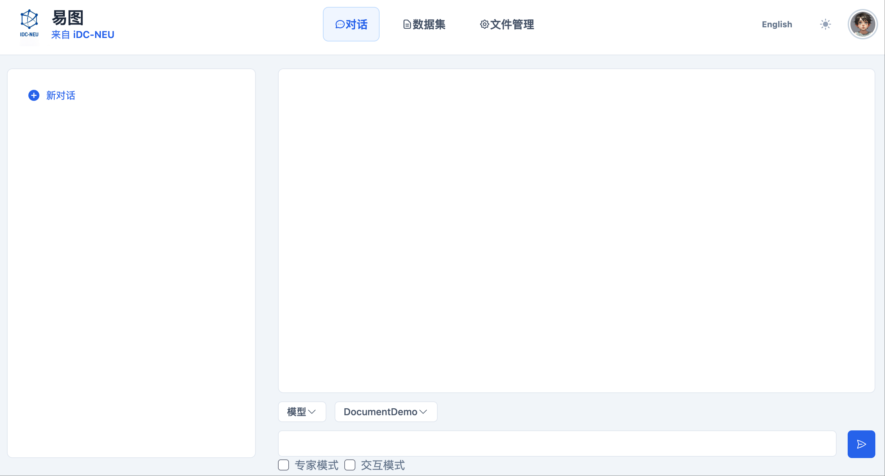
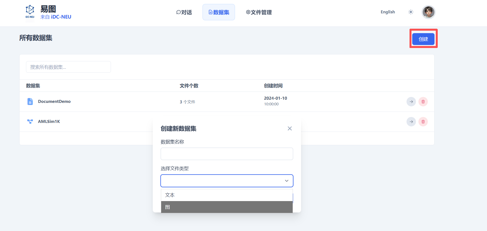
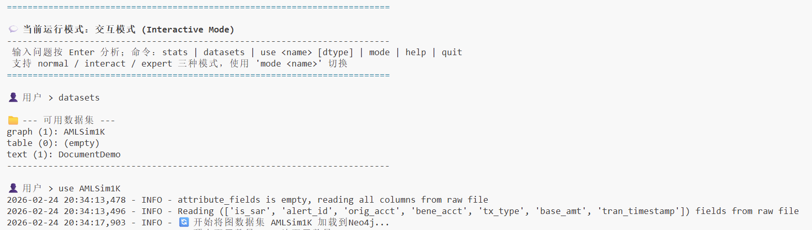

# 易图（YiGraph）

<div align="center">

<table border="0" cellspacing="0" cellpadding="0">
  <tr>
    <td align="center" valign="middle" style="padding-right: 30px;">
      
    </td>
    <td align="left" valign="middle">
      <h2 style="margin: 0; font-size: 24px; font-weight: 600; color: #2c3e50;">基于 AAG 框架的端到端<br/>图数据分析智能体系统</h2>
    </td>
  </tr>
</table>

<p style="margin-top: 20px;">
  <a href="LICENSE"></a>
  <a href="https://www.python.org/downloads/"></a>
  <a href="http://iDC-NEU.github.io/YiGraphDocs/"></a>
  <a href="#-联系我们"></a>
</p>

[English](README_EN.md) | 简体中文

</div>

---

## 📖 项目介绍

**易图（YiGraph）是一套端到端的图数据分析智能体系统**，用于帮助用户从复杂数据中快速洞察关键关联关系。

易图能够从日志、文档、表格等多类原始数据中，自动抽取实体与关系，构建结构化的图数据；用户只需通过**自然语言**描述业务问题，系统即可自动规划分析流程，完成计算，并生成**清晰、可解释、可追溯的分析报告**。

在系统内部，**大语言模型**负责理解用户意图、拆解分析任务并组织最终输出；而支撑分析结果可靠性的核心技术是 **AAG（Analytics-Augmented Generation，分析增强生成）框架**。AAG 将分析计算作为核心能力，在关键环节调用图算法与图系统完成可验证的计算，再由模型对结果进行解释与汇总。

因此，易图并非只"回答问题"的对话式 AI，而是一套能够将业务问题转化为**可执行、可复核分析流程**的图分析智能体。

### 适用场景

易图可灵活适配不同行业与业务需求，覆盖多类复杂关联数据分析场景，包括但不限于：

- **金融反洗钱与可疑交易分析**：将海量交易流水自动构建为交易网络，识别异常资金路径与可疑交易环路
- **电商风控与羊毛党识别**：融合账号、设备、地址等多源数据建图，发现团伙化作弊与关联作恶行为
- **企业关联与风险排查**：通过企业、股权、交易等关系建图，穿透复杂结构，识别潜在合规与经营风险
- **园区/城市事件分析**：将门禁、轨迹、事件数据统一建图，还原人员关系与事件演化过程
- **供应链风险分析**：整合企业与交易数据构建供应链网络，定位隐蔽关联风险及传导路径

---

## ⚡ 核心功能

### 1. 知识驱动的任务规划

系统会先理解用户问题"想解决什么"，再把它拆成可执行的分析步骤：
- 需要哪些数据字段与关系
- 该构建怎样的图（哪些实体、哪些关系）
- 该用哪些分析方法与参数
- 分析结果需要如何解释与呈现

> 你不需要懂图算法，系统会把"我要查什么"转成"怎么做分析"。

### 2. 以算法为核心的可靠执行

易图不会让模型随意"写一段不可控的代码再去跑"。相反，它会以"可验证的算法模块"为中心进行调用与组合，让每一步分析：
- **可复现**：同样输入得到稳定一致的输出
- **可追溯**：知道用了哪些算法、跑了哪些步骤
- **更可靠**：关键计算由专业模块完成，而不是纯文本推理

### 3. 任务感知的图构建

易图不会把所有原始数据不加区分地建成一张大图。它会根据当前任务需要，选择性抽取与构建"与问题相关的实体与关系"，避免无关结构干扰分析，并把图组织成更适合执行的形式，从而提升效率与结果质量。

### 4. 丰富的图算法库

内置 **100+ 种图算法**，覆盖 11 大类别，为各类图分析场景提供专业算法支持：

| 算法类别 | 算法数量 | 典型算法 | 应用场景 |
|---------|---------|---------|---------|
| [**Basics（基础算子）**](docs-site/docs/tutorial-algorithm/basic.md) | 10 个 | BFS、DFS、拓扑排序、DAG 判定、祖先/后代查询 | 图结构校验、依赖分析、层级遍历 |
| [**Path（路径算法）**](docs-site/docs/tutorial-algorithm/path.md) | 13 个 | Dijkstra、Bellman-Ford、Floyd-Warshall、欧拉路径、DAG 最长路径 | 路径规划、关系链分析、关键路径 |
| [**Centrality（中心性算法）**](docs-site/docs/tutorial-algorithm/centrality.md) | 14 个 | PageRank、介数中心性、接近中心性、特征向量中心性、HITS、VoteRank | 关键节点识别、影响力评估、种子选择 |
| [**Connectivity & Components（连通性与组件）**](docs-site/docs/tutorial-algorithm/Connectivity_Components.md) | 13 个 | 连通分量、强连通分量、割点/割边、最小割、节点/边连通度 | 网络稳健性、脆弱性分析、孤岛识别 |
| [**Clustering & Community（聚类与社区）**](docs-site/docs/tutorial-algorithm/Clustering_Community.md) | 17 个 | Louvain、Leiden、标签传播、k-clique、Girvan-Newman、聚类系数、环检测 | 圈层识别、团伙发现、紧密度分析 |
| [**Tree & Spanning Tree（树与生成树）**](docs-site/docs/tutorial-algorithm/tree.md) | 3 个 | 最小生成树、最大生成树、随机生成树 | 网络骨架提取、成本优化 |
| [**Flow & Cut（流与割）**](docs-site/docs/tutorial-algorithm/flow.md) | 5 个 | Edmonds-Karp、最大流、最小割、Gomory-Hu 树 | 容量规划、瓶颈分析、网络韧性 |
| [**Matching & Coloring（匹配与着色）**](docs-site/docs/tutorial-algorithm/matching_coloring.md) | 6 个 | 最大/最小权重匹配、贪心着色、最小边覆盖 | 资源分配、冲突检测、任务调度 |
| [**Cliques & Cores（团与核）**](docs-site/docs/tutorial-algorithm/cliques_cores.md) | 4 个 | 极大团枚举、最大权重团、k-core、核数计算 | 紧密群体发现、核心成员识别 |
| [**Distance & Measures（距离与结构度量）**](docs-site/docs/tutorial-algorithm/distance.md) | 8 个 | 离心率、直径、半径、中心/边缘、维纳指数、同配系数 | 网络体检、拓扑对比、结构偏好分析 |
| [**Graph Query（图查询）**](docs-site/docs/tutorial-algorithm/graph_query.md) | 8 个 | 节点查询、关系过滤、邻居查询、路径查询、共同邻居、子图抽取、聚合统计 | 数据获取与筛选、交互式探索、风控排查 |

> 详细的算法说明和使用指南请参考 **[📚 在线文档](http://superccy.github.io/YiGraphDocs/)**


### 5. 灵活的数据支持

支持多种数据源输入：
- **图数据**
- **文本数据**：文档、日志、报告等非结构化数据

系统会自动从原始数据中抽取实体与关系，构建结构化的图数据。

### 6. 多种运行模式

- **普通模式**：用户只需提交业务问题，易图会自动完成问题解析、选择合适的图算法并执行计算，最终生成分析报告，适合非技术背景或一般业务用户使用。
- **交互模式**：用户与易图协同完成业务问题分析。对于给定问题，易图会与大模型交互共同确定计算流程与图算法，再依据确定好的方案完成计算并反馈分析报告，适合对业务和图算法都有一定了解的进阶用户。
- **专家模式**：用户直接给出业务问题以及解决思路、计算步骤与图算法，易图根据用户提供的方案执行计算并输出分析报告，适合深度掌握业务与图算法的专家用户。

---

## 🎯 版本发布

### v0.1.0 (当前版本)

**核心能力**
- ✅ 完整的图计算引擎（基于 NetworkX 和 Neo4j）
- ✅ 智能任务规划与执行
- ✅ 100+ 种图算法支持，覆盖 11 大类别
- ✅ 多数据源支持（图/文本）
- ✅ 交互式对话界面


### 路线图

**v0.2.0（计划中）**
- 🔄 图算法扩展至200-300个
- 🔄 新增图学习模块


---

## 🚀 快速开始

### 1. 准备环境

#### 1.1 Python 版本要求

- Python >= **3.11**

请确认当前 Python 版本满足要求：

```bash
python --version
# 或
python3 --version
```

#### 1.2 使用 Conda 创建虚拟环境(推荐)

```bash
conda create -n AAG python=3.11
conda activate AAG
```

#### 1.3 Neo4j 安装与配置

易图需要使用 Neo4j 作为图数据库。本指南使用 **Neo4j 3.5.25** 版本。

##### 1.3.1 Java 版本要求

Neo4j 3.5.25 需要 Java 8 或 Java 11。请先检查 Java 版本：

```bash
java -version
```

如果未安装 Java，请先安装对应版本。

##### 1.3.2 下载与解压 Neo4j

1. 从官网下载 Neo4j 3.5.25 安装包（通常是 `.tar.gz` 或 `.zip` 格式）
2. 解压安装包到指定位置：

**Linux/Mac 系统（.tar.gz 格式）：**
```bash
tar -xzf neo4j-community-3.5.25-unix.tar.gz
cd neo4j-community-3.5.25
```

**Windows 系统（.zip 格式）：**
- 右键点击压缩包，选择"解压到当前文件夹"
- 或使用命令：`unzip neo4j-community-3.5.25-windows.zip`
- 进入解压后的目录

##### 1.3.3 配置 Neo4j

进入 `conf` 目录，编辑 `neo4j.conf` 配置文件：

```bash
cd conf
```

在 `neo4j.conf` 中添加或修改以下配置：

```properties
dbms.connectors.default_listen_address=0.0.0.0
dbms.connectors.default_advertised_address=localhost
dbms.connector.bolt.listen_address=0.0.0.0:7687
dbms.connector.http.listen_address=0.0.0.0:7474
dbms.connector.https.enabled=true
```

##### 1.3.4 启动与停止 Neo4j

进入 `bin` 目录，执行启动或停止命令：

**启动 Neo4j：**
```bash
cd bin
./neo4j start
```

**停止 Neo4j：**
```bash
./neo4j stop
```

启动 Neo4j 后，可以通过浏览器访问 `http://localhost:7474` 来验证安装是否成功。

### 2. 获取源码并安装依赖

#### 2.1 下载源码

```bash
git clone https://github.com/iDC-NEU/YiGraph.git
cd YiGraph
```

#### 2.2 安装依赖

```bash
pip install -r requirements.txt
```

### 3. 配置系统参数

#### 3.1 配置推理与检索引擎

编辑配置文件：

```text
config/engine_config.yaml
```

示例配置如下：

```yaml
# 运行模式： interactive / batch
mode: interactive

# 推理模块配置
reasoner:
  llm:
    provider: "openai"   # 可选：ollama / openai
    openai:
      base_url: "https://your-api-endpoint/v1/"
      api_key: "your-api-key"
      model: "gpt-4o-mini"

# 检索模块配置
retrieval:
  database:
    graph:
      space_name: "AMLSim1K"
      server_ip: "127.0.0.1"
      server_port: "9669"
    vector:
      collection_name: "graphllm_collection"
      host: "localhost"
      port: 19530
  embedding:
    model_name: "BAAI/bge-large-en-v1.5"
    device: "cuda:2"
  rag:
    graph:
      k_hop: 2
    vector:
      k_similarity: 5
```

#### 3.2 配置数据集

编辑配置文件：

```text
config/data_upload_config.yaml
```

示例配置如下：

```yaml
datasets:
  - name: AMLSim1K
    type: graph
    schema:
      vertex:
        - type: account
          path: "/path/to/accounts.csv"
          format: csv
          id_field: acct_id
      edge:
        - type: transfer
          path: "/path/to/transactions.csv"
          format: csv
          source_field: orig_acct
          target_field: bene_acct
```

> 请将 `path` 修改为你本地真实的数据文件路径。

### 4. 启动易图

> **重要提示：** 在启动易图之前，请确保 Neo4j 数据库已经启动并正常运行。如果 Neo4j 未启动，易图将无法连接到图数据库。请参考 [1.3.4 启动与停止 Neo4j](#134-启动与停止-neo4j) 部分启动 Neo4j。

易图支持以下两种运行模式：

- **Web 交互模式（推荐）**
  通过浏览器进行交互式分析，适合日常使用、演示与业务分析场景。

- **终端交互模式（Terminal）**
  通过命令行进行交互，适合开发调试、快速验证与批量测试场景。

#### 4.1 Web 交互模式

在项目根目录下执行以下命令启动 Web 服务：

```bash
python web/frontend/run.py
```

启动成功后，终端会输出可访问的服务地址。请根据提示在浏览器中打开对应地址，即可进入易图的 Web 界面。

在 Web 界面中，用户可以通过自然语言输入业务问题，系统将自动完成分析流程，并展示分析结果与报告。

##### Web 界面使用说明



使用易图 Web 界面进行分析的基本步骤如下：

1. **开始对话**：开启一个新对话或者从历史记录中选择一个现有对话。

2. **选择模式**：选择最适合您的模式。

3. **选择数据集**：会将您上传好的数据集列举出来。例如：DocumentDemo。

4. **输入您的请求**：在输入框中输入您的指令或问题。请尽可能清晰和具体。

5. **提交**：点击发送按钮。

6. **监控进度**：在主聊天区观察状态更新（运行中、规划中、分析中等）。

7. **查看结果**：处理完成后，结果将显示在主聊天区。然后您可以提出后续问题或开始新的请求。

##### 数据集管理



在 Web 界面中，您可以方便地管理数据集：

1. **创建数据集**：点击"创建"按钮。

2. **填写数据集信息**：
   - 输入数据集的名称
   - 选择数据集中文件的类型

3. **上传数据文件**：根据选择的文件类型上传相应的数据文件。

4. **保存数据集**：完成配置后保存，数据集将在对话中可供选择使用。

##### 文件管理


在文件管理界面中，您可以对数据集中的文件进行管理和可视化：

1. **选择数据集**：从下拉列表中选择对应的数据集。

2. **上传文件**：向选定的数据集中上传文件。

3. **查看解析进度**：系统会显示文件的解析进度，实时反馈处理状态。

4. **可视化知识图谱**：文件解析完成后，点击"可视化"按钮，即可查看该数据集对应的知识图谱可视化展示。

#### 4.2 终端交互模式（Terminal）

如果希望直接通过命令行与易图进行交互，可在项目根目录下执行：

```bash
python aag/main.py
```

启动后，系统将进入终端交互模式。用户可按照终端提示输入问题，易图将在命令行中完成分析并输出结果。



##### 终端交互使用说明

使用终端交互模式的基本步骤：

1. **查看可用数据集**：通过指令查看系统中有哪些可用的数据集。

2. **选择数据集**：根据提示选择要使用的数据集。

3. **输入问题**：直接在终端中输入您的业务问题或分析需求。

4. **查看结果**：系统会在终端中实时显示分析过程和最终结果。

该模式主要用于开发调试、算法验证或快速测试场景。

### 5. 使用易图

无论采用 Web 模式还是终端模式，易图的基本使用流程一致：

- 启动对应的运行模式
- 根据提示输入自然语言业务问题
- 系统自动完成任务理解、分析执行与结果生成

更多高级功能、参数说明与使用示例，请参考项目的 README 文档或界面中的操作提示。

### 6. 常见问题建议

- **GPU 设备不可用**：请确认 `embedding.device` 设置正确
- **端口冲突**：检查图数据库与向量数据库服务是否已启动
- **模型无法加载**：确认 API Key 与模型名称是否有效


## 📖 文档与资源

### 📚 在线文档

访问完整的用户手册和开发者指南：

**[http://superccy.github.io/YiGraphDocs/](http://superccy.github.io/YiGraphDocs/)**

文档内容包括：
- **快速入门**：系统安装、配置和基本使用
- **核心概念**：AAG 框架原理和架构设计
- **算法文档**：100+ 种图算法的详细说明和使用示例
- **API 参考**：完整的 API 接口文档
- **最佳实践**：典型场景的分析案例和经验总结

## 📞 联系我们


### 贡献指南

我们欢迎各种形式的贡献：

- 🐛 报告 Bug
- 💡 提出新功能建议
- 📝 改进文档
- 🔧 提交代码


### 社区交流


<div align="center">

| 微信 | 小红书 | Twitter |
|:---:|:---:|:---:|
|  |  |  |

</div>


---

## 📚 引用

如果您在研究中使用了易图（YiGraph）或 AAG 框架，请引用我们的论文：

```bibtex
@article{YiGraph2026,
  title={Towards Autonomous Graph Data Analytics with Analytics-Augmented Generation},
  author={Qiange Wang, Chaoyi Chen, Jingqi Gao, Zihan Wang, Yanfeng Zhang, Ge Yu},
  journal={arXiv preprint arXiv:2602.21604},
  year={2026}
}
```

### 致谢

本项目受益于以下开源项目：

- [NetworkX](https://networkx.org/) - 图分析和算法库
- [PyTorch Geometric](https://pytorch-geometric.readthedocs.io/) - 图深度学习框架
- [NebulaGraph](https://www.nebula-graph.io/) - 分布式图数据库
- [Milvus](https://milvus.io/) - 向量数据库
- [LlamaIndex](https://www.llamaindex.ai/) - RAG 框架

感谢所有贡献者的辛勤付出！

---

## 📄 许可证

本项目采用 [MIT License](LICENSE) 开源协议。

---

## ⭐ Star History

如果这个项目对您有帮助，欢迎 Star ⭐ 支持我们！

[](https://star-history.com/#iDC-NEU/YiGraph&Date)

---

<div align="center">

**让图数据分析更简单、更智能**

</div>

---


