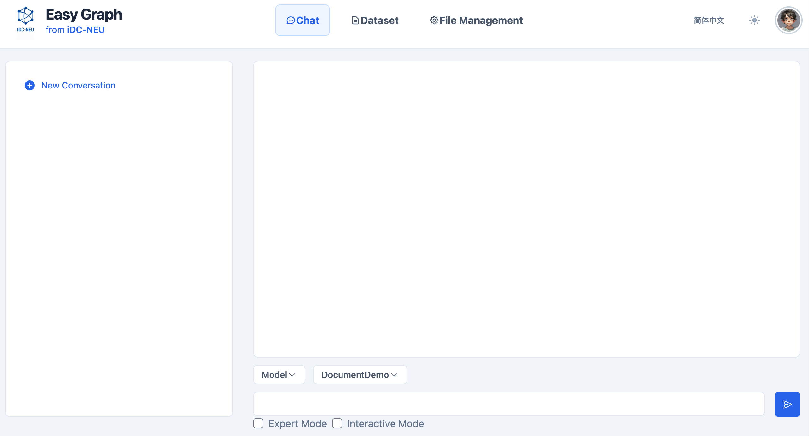
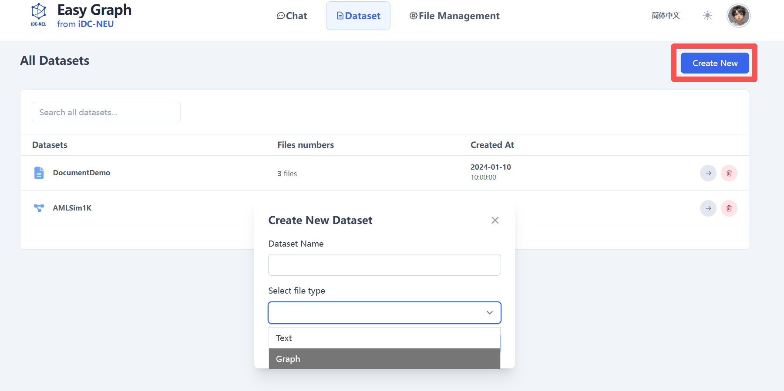
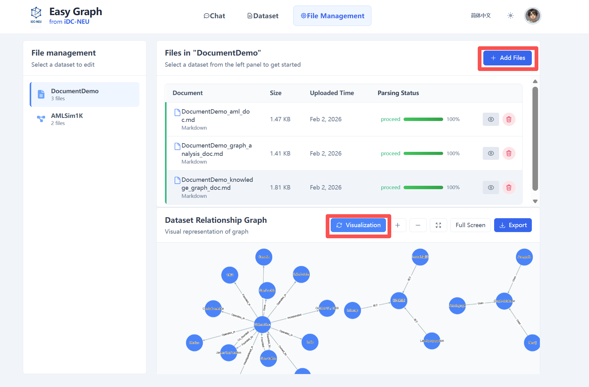

# YiGraph

<div align="center">

<table border="0" cellspacing="0" cellpadding="0">
  <tr>
    <td align="center" valign="middle" style="padding-right: 30px;">
      
    </td>
    <td align="left" valign="middle">
      <h2 style="margin: 0; font-size: 24px; font-weight: 600; color: #2c3e50;">End-to-End Intelligent Graph Data<br/>Analysis Agent System Based on AAG Framework</h2>
    </td>
  </tr>
</table>

<p style="margin-top: 20px;">
  <a href="LICENSE"></a>
  <a href="https://www.python.org/downloads/"></a>
  <a href="http://iDC-NEU.github.io/YiGraphDocs/"></a>
  <a href="#-contact-us"></a>
</p>

English | [简体中文](README.md)

</div>

---

## 📖 Project Introduction

**YiGraph is an end-to-end intelligent graph data analysis agent system** designed to help users quickly gain insights into key relationships from complex data.

YiGraph can automatically extract entities and relationships from various raw data sources such as logs, documents, and tables to build structured graph data. Users only need to describe business problems in **natural language**, and the system will automatically plan the analysis process, complete calculations, and generate **clear, interpretable, and traceable analysis reports**.

Internally, **large language models** are responsible for understanding user intent, breaking down analysis tasks, and organizing final outputs. The core technology supporting the reliability of analysis results is the **AAG (Analytics-Augmented Generation) framework**. AAG treats analytical computation as a core capability, invoking graph algorithms and graph systems at key stages to complete verifiable calculations, which are then interpreted and summarized by the model.

Therefore, YiGraph is not just a conversational AI that "answers questions", but an intelligent graph analysis agent that can transform business problems into **executable and reviewable analysis processes**.

### Applicable Scenarios

YiGraph can flexibly adapt to different industries and business needs, covering various complex relational data analysis scenarios, including but not limited to:

- **Financial anti-money laundering and suspicious transaction analysis**: Automatically build transaction networks from massive transaction flows to identify abnormal fund paths and suspicious transaction loops
- **E-commerce risk control and wool party identification**: Integrate multi-source data such as accounts, devices, and addresses to build graphs and discover organized fraud and associated malicious behavior
- **Enterprise association and risk investigation**: Build graphs through enterprise, equity, and transaction relationships to penetrate complex structures and identify potential compliance and operational risks
- **Park/city event analysis**: Unify access control, trajectory, and event data into graphs to restore personnel relationships and event evolution processes
- **Supply chain risk analysis**: Integrate enterprise and transaction data to build supply chain networks, locate hidden associated risks and transmission paths

---

## ⚡ Core Features

### 1. Knowledge-Driven Task Planning

The system first understands what the user's question "wants to solve", then breaks it down into executable analysis steps:
- What data fields and relationships are needed
- What kind of graph should be built (which entities, which relationships)
- What analysis methods and parameters should be used
- How analysis results should be interpreted and presented

> You don't need to understand graph algorithms; the system will translate "what I want to query" into "how to do the analysis".

### 2. Algorithm-Centric Reliable Execution

YiGraph will not let the model arbitrarily "write a piece of uncontrollable code and run it". Instead, it centers on "verifiable algorithm modules" for invocation and combination, making each analysis step:
- **Reproducible**: Same input yields stable and consistent output
- **Traceable**: Know which algorithms were used and which steps were executed
- **More reliable**: Key calculations are completed by professional modules rather than pure text reasoning

### 3. Task-Aware Graph Construction

YiGraph will not indiscriminately build all raw data into one large graph. It will selectively extract and construct "entities and relationships relevant to the problem" based on current task needs, avoiding interference from irrelevant structures, and organize the graph into a form more suitable for execution, thereby improving efficiency and result quality.

### 4. Rich Graph Algorithm Library

Built-in **100+ graph algorithms** covering 11 major categories, providing professional algorithm support for various graph analysis scenarios:

| Algorithm Category | Number of Algorithms | Typical Algorithms | Application Scenarios |
|---------|---------|---------|---------|
| [**Basics**](docs-site/docs/tutorial-algorithm/basic.md) | 10 | BFS, DFS, Topological Sort, DAG Detection, Ancestor/Descendant Query | Graph structure validation, dependency analysis, hierarchical traversal |
| [**Path**](docs-site/docs/tutorial-algorithm/path.md) | 13 | Dijkstra, Bellman-Ford, Floyd-Warshall, Eulerian Path, DAG Longest Path | Path planning, relationship chain analysis, critical path |
| [**Centrality**](docs-site/docs/tutorial-algorithm/centrality.md) | 14 | PageRank, Betweenness Centrality, Closeness Centrality, Eigenvector Centrality, HITS, VoteRank | Key node identification, influence assessment, seed selection |
| [**Connectivity & Components**](docs-site/docs/tutorial-algorithm/Connectivity_Components.md) | 13 | Connected Components, Strongly Connected Components, Cut Vertices/Edges, Minimum Cut, Node/Edge Connectivity | Network robustness, vulnerability analysis, island identification |
| [**Clustering & Community**](docs-site/docs/tutorial-algorithm/Clustering_Community.md) | 17 | Louvain, Leiden, Label Propagation, k-clique, Girvan-Newman, Clustering Coefficient, Cycle Detection | Circle identification, gang discovery, tightness analysis |
| [**Tree & Spanning Tree**](docs-site/docs/tutorial-algorithm/tree.md) | 3 | Minimum Spanning Tree, Maximum Spanning Tree, Random Spanning Tree | Network skeleton extraction, cost optimization |
| [**Flow & Cut**](docs-site/docs/tutorial-algorithm/flow.md) | 5 | Edmonds-Karp, Maximum Flow, Minimum Cut, Gomory-Hu Tree | Capacity planning, bottleneck analysis, network resilience |
| [**Matching & Coloring**](docs-site/docs/tutorial-algorithm/matching_coloring.md) | 6 | Maximum/Minimum Weight Matching, Greedy Coloring, Minimum Edge Cover | Resource allocation, conflict detection, task scheduling |
| [**Cliques & Cores**](docs-site/docs/tutorial-algorithm/cliques_cores.md) | 4 | Maximal Clique Enumeration, Maximum Weight Clique, k-core, Core Number | Tight group discovery, core member identification |
| [**Distance & Measures**](docs-site/docs/tutorial-algorithm/distance.md) | 8 | Eccentricity, Diameter, Radius, Center/Periphery, Wiener Index, Assortativity Coefficient | Network health check, topology comparison, structural preference analysis |
| [**Graph Query**](docs-site/docs/tutorial-algorithm/graph_query.md) | 8 | Node Query, Relationship Filtering, Neighbor Query, Path Query, Common Neighbors, Subgraph Extraction, Aggregation Statistics | Data retrieval and filtering, interactive exploration, risk control investigation |

> For detailed algorithm descriptions and usage guides, please refer to **[📚 Online Documentation](http://superccy.github.io/YiGraphDocs/)**


### 5. Flexible Data Support

Supports multiple data source inputs:
- **Graph Data**
- **Text Data**: Documents, logs, reports, and other unstructured data

The system will automatically extract entities and relationships from raw data to build structured graph data.

### 6. Multiple Operating Modes

- **Normal Mode**: Users only need to submit their business questions. YiGraph will automatically parse the problem, select appropriate graph algorithms, execute the computation, and generate an analysis report. This mode is suitable for non-technical or general business users.
- **Interactive Mode**: Users collaborate with YiGraph to analyze business problems. For a given question, YiGraph interacts with the LLM to determine the computation workflow and graph algorithms, then executes the plan and returns an analysis report. This mode is suitable for advanced users who are familiar with both the business and graph algorithms.
- **Expert Mode**: Users directly specify the business problem along with the solution approach, computation steps, and graph algorithms. YiGraph then executes the provided plan and returns an analysis report. This mode is intended for expert users with deep knowledge of the business and graph algorithms.

---

## 🎯 Version Release

### v0.1.0 (Current Version)

**Core Capabilities**
- ✅ Complete graph computing engine (based on NetworkX and  Neo4j)
- ✅ Intelligent task planning and execution
- ✅ 100+ graph algorithms support, covering 11 major categories
- ✅ Multi-data source support (graph/text)
- ✅ Interactive dialogue interface

### Roadmap

**v0.2.0 (Planned)**
- 🔄 Expand the graph algorithm library to 200–300 algorithms
- 🔄 Add an integrated graph learning module (training/inference)


---

## 🚀 Quick Start

### 1. Environment Preparation

#### 1.1 Python Version Requirements

- Python >= **3.11**

Please confirm that the current Python version meets the requirements:

```bash
python --version
# or
python3 --version
```

#### 1.2 Create Virtual Environment with Conda (Recommended)

```bash
conda create -n AAG python=3.11
conda activate AAG
```

#### 1.3 Neo4j Installation and Configuration

YiGraph requires Neo4j as the graph database. This guide uses **Neo4j 3.5.25**.

##### 1.3.1 Java Version Requirements

Neo4j 3.5.25 requires Java 8 or Java 11. Please check your Java version:

```bash
java -version
```

If Java is not installed, please install the appropriate version first.

##### 1.3.2 Download and Extract Neo4j

1. Download the Neo4j 3.5.25 installation package from the official website (usually in `.tar.gz` or `.zip` format)
2. Extract the package to your desired location:

**Linux/Mac systems (.tar.gz format):**
```bash
tar -xzf neo4j-community-3.5.25-unix.tar.gz
cd neo4j-community-3.5.25
```

**Windows systems (.zip format):**
- Right-click the archive and select "Extract to current folder"
- Or use command: `unzip neo4j-community-3.5.25-windows.zip`
- Navigate to the extracted directory

##### 1.3.3 Configure Neo4j

Enter the `conf` directory and edit the `neo4j.conf` file:

```bash
cd conf
```

Add or modify the following settings in `neo4j.conf`:

```properties
dbms.connectors.default_listen_address=0.0.0.0
dbms.connectors.default_advertised_address=localhost
dbms.connector.bolt.listen_address=0.0.0.0:7687
dbms.connector.http.listen_address=0.0.0.0:7474
dbms.connector.https.enabled=true
```

##### 1.3.4 Start and Stop Neo4j

Navigate to the `bin` directory to start or stop Neo4j:

**Start Neo4j:**
```bash
cd bin
./neo4j start
```

**Stop Neo4j:**
```bash
./neo4j stop
```

After starting Neo4j, you can access the web interface at `http://localhost:7474` to verify the installation.

### 2. Get Source Code and Install Dependencies

#### 2.1 Download Source Code

```bash
git clone https://github.com/iDC-NEU/YiGraph.git
cd YiGraph
```

#### 2.2 Install Dependencies

```bash
pip install -r requirements.txt
```

### 3. Configure System Parameters

#### 3.1 Configure Inference and Retrieval Engine

Edit the configuration file:

```text
config/engine_config.yaml
```

Example configuration:

```yaml
# Running mode: interactive / batch
mode: interactive

# Reasoner module configuration
reasoner:
  llm:
    provider: "openai"   # Options: ollama / openai
    openai:
      base_url: "https://your-api-endpoint/v1/"
      api_key: "your-api-key"
      model: "gpt-4o-mini"

# Retrieval module configuration
retrieval:
  database:
    graph:
      space_name: "AMLSim1K"
      server_ip: "127.0.0.1"
      server_port: "9669"
    vector:
      collection_name: "graphllm_collection"
      host: "localhost"
      port: 19530
  embedding:
    model_name: "BAAI/bge-large-en-v1.5"
    device: "cuda:2"
  rag:
    graph:
      k_hop: 2
    vector:
      k_similarity: 5
```

#### 3.2 Configure Dataset

Edit the configuration file:

```text
config/data_upload_config.yaml
```

Example configuration:

```yaml
datasets:
  - name: AMLSim1K
    type: graph
    schema:
      vertex:
        - type: account
          path: "/path/to/accounts.csv"
          format: csv
          id_field: acct_id
      edge:
        - type: transfer
          path: "/path/to/transactions.csv"
          format: csv
          source_field: orig_acct
          target_field: bene_acct
```

> Please modify `path` to your local actual data file path.

### 4. Start YiGraph

> **Important Note:** Before starting YiGraph, please ensure that the Neo4j database is already running. If Neo4j is not started, YiGraph will not be able to connect to the graph database. Please refer to [1.3.4 Start and Stop Neo4j](#134-start-and-stop-neo4j) to start Neo4j.

YiGraph supports the following two operating modes:

- **Web Interactive Mode (Recommended)**
  Perform interactive analysis through a browser, suitable for daily use, demonstrations, and business analysis scenarios.

- **Terminal Interactive Mode**
  Interact through the command line, suitable for development debugging, quick verification, and batch testing scenarios.

#### 4.1 Web Interactive Mode

Execute the following command in the project root directory to start the Web service:

```bash
python web/frontend/run.py
```

After successful startup, the terminal will output the accessible service address. Please open the corresponding address in your browser according to the prompt to enter YiGraph's Web interface.

In the Web interface, users can input business questions in natural language, and the system will automatically complete the analysis process and display analysis results and reports.

##### Web Interface Usage Guide



Basic steps for using the YiGraph web interface for analysis:

1. **Start Conversation**: Start a new conversation or select an existing conversation from history.

2. **Select Mode**: Choose the mode that best suits your needs.

3. **Select Dataset**: The system will list your uploaded datasets. For example: DocumentDemo.

4. **Enter Your Request**: Type your instructions or questions in the input box. Please be as clear and specific as possible.

5. **Submit**: Click the send button.

6. **Monitor Progress**: Observe status updates in the main chat area (Running, Planning, Analyzing, etc.).

7. **View Results**: After processing is complete, results will be displayed in the main chat area. You can then ask follow-up questions or start a new request.

##### Dataset Management



In the web interface, you can conveniently manage datasets:

1. **Create Dataset**: Click the "Create New" button.

2. **Fill in Dataset Information**:
   - Enter the dataset name
   - Select the file type for the dataset

3. **Upload Data Files**: Upload corresponding data files based on the selected file type.

4. **Save Dataset**: After completing the configuration, save it. The dataset will be available for selection in conversations.

##### File Management



In the file management interface, you can manage and visualize files in datasets:

1. **Select Dataset**: Choose the corresponding dataset from the dropdown list.

2. **Upload Files**: Upload files to the selected dataset.

3. **View Parsing Progress**: The system will display file parsing progress and provide real-time status feedback.

4. **Visualize Knowledge Graph**: After file parsing is complete, click the "Visualization" button to view the knowledge graph visualization for that dataset.

#### 4.2 Terminal Interactive Mode

If you want to interact with YiGraph directly through the command line, you can execute in the project root directory:

```bash
python aag/main.py
```

After startup, the system will enter terminal interactive mode. Users can input questions according to terminal prompts, and YiGraph will complete the analysis and output results in the command line.


##### Terminal Interactive Usage Guide

Basic steps for using terminal interactive mode:

1. **View Available Datasets**: Use commands to view available datasets in the system.

2. **Select Dataset**: Select the dataset you want to use according to the prompts.

3. **Enter Questions**: Directly input your business questions or analysis requirements in the terminal.

4. **View Results**: The system will display the analysis process and final results in real-time in the terminal.

This mode is mainly used for development debugging, algorithm verification, or quick testing scenarios.

### 5. Using YiGraph

Whether using Web mode or terminal mode, YiGraph's basic usage process is consistent:

- Start the corresponding operating mode
- Input natural language business questions according to prompts
- The system automatically completes task understanding, analysis execution, and result generation

For more advanced features, parameter descriptions, and usage examples, please refer to the project's README documentation or operation prompts in the interface.

### 6. Common Issues and Suggestions

- **GPU device unavailable**: Please confirm that `embedding.device` is set correctly
- **Port conflict**: Check if graph database and vector database services have been started
- **Model cannot be loaded**: Confirm that API Key and model name are valid


## 📖 Documentation & Resources

### 📚 Online Documentation

Access the complete user manual and developer guide:

**[http://superccy.github.io/YiGraphDocs/](http://superccy.github.io/YiGraphDocs/)**

Documentation includes:
- **Quick Start**: System installation, configuration, and basic usage
- **Core Concepts**: AAG framework principles and architecture design
- **Algorithm Documentation**: Detailed descriptions and usage examples of 100+ graph algorithms
- **API Reference**: Complete API interface documentation
- **Best Practices**: Analysis cases and experience summaries for typical scenarios


## 📞 Contact Us


### Contribution Guidelines

We welcome all forms of contributions:

- 🐛 Report Bugs
- 💡 Suggest New Features
- 📝 Improve Documentation
- 🔧 Submit Code


### Community Communication


<div align="center">

| WeChat | Xiaohongshu | Twitter |
|:---:|:---:|:---:|
|  |  |  |

</div>


---

## 📚 Citation

If you use YiGraph or the AAG framework in your research, please cite our paper:

```bibtex
@article{YiGraph2026,
  title={Towards Autonomous Graph Data Analytics with Analytics-Augmented Generation},
  author={Qiange Wang, Chaoyi Chen, Jingqi Gao, Zihan Wang, Yanfeng Zhang, Ge Yu},
  journal={arXiv preprint arXiv:2602.21604},
  year={2026}
}
```

### Acknowledgments

This project benefits from the following open source projects:

- [NetworkX](https://networkx.org/) - Graph analysis and algorithm library
- [PyTorch Geometric](https://pytorch-geometric.readthedocs.io/) - Graph deep learning framework
- [NebulaGraph](https://www.nebula-graph.io/) - Distributed graph database
- [Milvus](https://milvus.io/) - Vector database
- [LlamaIndex](https://www.llamaindex.ai/) - RAG framework

Thanks to all contributors for their hard work!

---

## 📄 License

This project is licensed under the [MIT License](LICENSE).

---

## ⭐ Star History

If this project helps you, please Star ⭐ to support us!

[](https://star-history.com/#iDC-NEU/YiGraph&Date)

---

<div align="center">

**Making Graph Data Analysis Simpler and Smarter**

</div>

---


