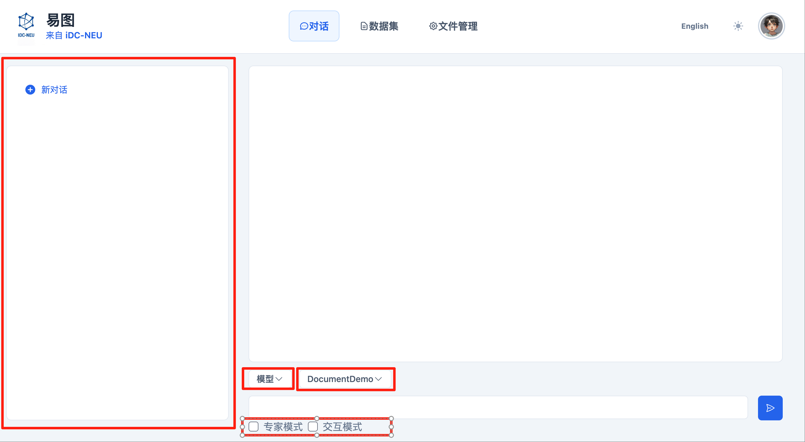
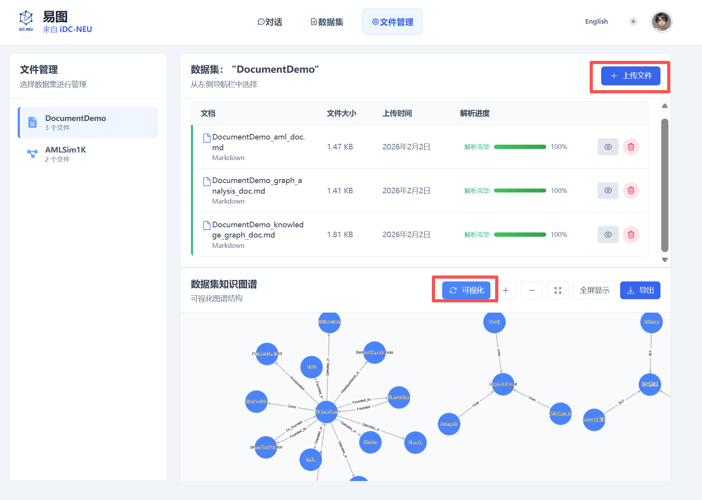

# YiGraph 安装与使用指南

本文档介绍了 **YiGraph**
项目的环境准备、安装步骤、配置方法以及基本使用方式。

------------------------------------------------------------------------

## 1. 准备环境

### 1.1 Python 版本要求

-   Python \>= **3.11**

请确认当前 Python 版本满足要求：

``` bash
python --version
# 或
python3 --version
```

### 1.2 使用 Conda 创建虚拟环境（推荐）

``` bash
conda create -n AAG python=3.11
conda activate AAG
```

### 1.3 Neo4j 安装与配置

YiGraph 需要使用 Neo4j 作为图数据库。本指南使用 **Neo4j 3.5.25** 版本。

#### 1.3.1 Java 版本要求

Neo4j 3.5.25 需要 Java 8 或 Java 11。请先检查 Java 版本：

``` bash
java -version
```

如果未安装 Java，请先安装对应版本。

#### 1.3.2 下载与解压 Neo4j

1. 从官网下载 Neo4j 3.5.25 安装包（通常是 `.tar.gz` 或 `.zip` 格式）
2. 解压安装包到指定位置：

**Linux/Mac 系统（.tar.gz 格式）：**
``` bash
tar -xzf neo4j-community-3.5.25-unix.tar.gz
cd neo4j-community-3.5.25
```

**Windows 系统（.zip 格式）：**
- 右键点击压缩包，选择"解压到当前文件夹"
- 或使用命令：`unzip neo4j-community-3.5.25-windows.zip`
- 进入解压后的目录

#### 1.3.3 配置 Neo4j

进入 `conf` 目录，编辑 `neo4j.conf` 配置文件：

``` bash
cd conf
```

在 `neo4j.conf` 中添加或修改以下配置：

``` properties
dbms.connectors.default_listen_address=0.0.0.0
dbms.connectors.default_advertised_address=localhost
dbms.connector.bolt.listen_address=0.0.0.0:7687
dbms.connector.http.listen_address=0.0.0.0:7474
dbms.connector.https.enabled=true
```

#### 1.3.4 启动与停止 Neo4j

进入 `bin` 目录，执行启动或停止命令：

**启动 Neo4j：**
``` bash
cd bin
./neo4j start
```

**停止 Neo4j：**
``` bash
./neo4j stop
```

启动 Neo4j 后，可以通过浏览器访问 `http://localhost:7474` 来验证安装是否成功。

------------------------------------------------------------------------

## 2. 获取源码并安装依赖

### 2.1 下载源码

``` bash
git clone https://github.com/iDC-NEU/YiGraph.git
cd YiGraph
```

### 2.2 安装依赖

``` bash
pip install -r requirements.txt
```

------------------------------------------------------------------------

## 3. 配置系统参数

本系统支持大语言模型推理（LLM）、向量检索（Milvus）以及图数据库（Neo4j）联合检索。请根据实际运行环境修改以下配置文件。

---

### 3.1 配置推理与检索引擎

编辑配置文件：

```text
config/engine_config.yaml
```

---

### 1️⃣ 推理模块（LLM）配置

系统支持两种 LLM Provider：

* `ollama`（本地部署模型）
* `openai`（OpenAI 或兼容 API，例如 DeepSeek、自建服务等）

#### 示例配置：

```yaml
reasoner:
  llm:
    # LLM provider: ollama (local) or openai (OpenAI-compatible API)
    provider: "openai"

    # Ollama config（当 provider=ollama 时使用）
    ollama:
      model_name: "llama3.1:70b"
      device: "cuda:0"
      timeout: 150000
      port: 11434

    # OpenAI-compatible API（当 provider=openai 时使用）
    openai:
      base_url: "https://your-api-endpoint/v1/"   # 必须以 / 结尾
      api_key: "your-api-key"
      model: "gpt-4o-mini"
```

#### 参数说明

| 参数         | 说明                            |
| ---------- | ----------------------------- |
| provider   | 选择 LLM 类型：`ollama` 或 `openai` |
| model_name | Ollama 本地模型名称                 |
| device     | GPU 设备编号（如 `cuda:0`）          |
| timeout    | 推理超时时间（毫秒）                    |
| base_url   | OpenAI 兼容 API 地址（必须以 `/` 结尾）  |
| api_key    | API 密钥                        |
| model      | 使用的模型名称                       |

> ⚠ 如果使用 OpenAI 兼容 API（如 DeepSeek、自建接口），请确保 `base_url` 正确并以 `/` 结尾。

---

### 2️⃣ 检索模块配置（Vector + Graph）

系统支持：

* **Milvus**（向量数据库，用于 RAG 检索）
* **Neo4j**（图数据库，用于图查询）

#### 示例配置：

```yaml
retrieval:
  database:
    # 向量数据库（Milvus）
    vector:
      host: "localhost"
      port: 19530

    # 图数据库（Neo4j）
    neo4j:
      enabled: true
      uri: "bolt://localhost:7687"
      user: "neo4j"
      password: "your-password"

  # 嵌入模型配置
  embedding:
    model_name: "BAAI/bge-large-en-v1.5"
    batch_size: 20
    chunk_size: 512
    chunk_overlap: 20
    device: "cuda:2"
```

---

### 参数说明

#### 📌 Milvus（向量数据库）

| 参数   | 说明           |
| ---- | ------------ |
| host | Milvus 服务器地址 |
| port | Milvus 端口    |

> 运行前请确保 Milvus 服务已启动（推荐 Docker 部署）。

---

#### 📌 Neo4j（图数据库）

| 参数       | 说明         |
| -------- | ---------- |
| enabled  | 是否启用 Neo4j |
| uri      | Bolt 协议地址  |
| user     | 数据库用户名     |
| password | 数据库密码      |

> 若不使用图数据库，可将 `enabled` 设置为 `false`。

---

#### 📌 Embedding（嵌入模型）

| 参数            | 说明               |
| ------------- | ---------------- |
| model_name    | HuggingFace 模型名称 |
| batch_size    | 批处理大小            |
| chunk_size    | 文本分块大小           |
| chunk_overlap | 分块重叠长度           |
| device        | GPU 设备编号         |

---

## 3.2 配置数据集

编辑配置文件：

```text
config/data_upload_config.yaml
```

系统支持 **graph** 和 **text** 两种数据类型。

---

### 图数据示例配置（AMLSim1K）

```yaml
datasets:
  - name: AMLSim1K
    type: graph   # graph / text
    description: "AMLSim 1K synthetic transaction graph."

    schema:
      # -----------------------------
      # 节点（Vertex）层
      # -----------------------------
      vertex:
        - type: account
          path: "aag/datasets/graphs/transaction_amlsim/1K/accounts.csv"
          format: csv
          id_field: acct_id
          label_field: prior_sar_count   # 可选

      # -----------------------------
      # 边（Edge）层
      # -----------------------------
      edge:
        - type: transfer
          path: "aag/datasets/graphs/transaction_amlsim/1K/transactions.csv"
          format: csv
          source_field: orig_acct
          target_field: bene_acct
          label_field: is_sar            # 可选

      # -----------------------------
      # 图级别配置
      # -----------------------------
      graph:
        directed: true
        multigraph: true
        weighted: false
        heterogeneous: false
```

---

### 参数说明

#### 📌 基本信息

| 参数          | 说明                    |
| ----------- | --------------------- |
| name        | 数据集名称                 |
| type        | 数据类型：`graph` 或 `text` |
| description | 数据集描述                 |

---

#### 📌 节点（vertex）配置

| 参数          | 说明                            |
| ----------- | ----------------------------- |
| type        | 节点类型                          |
| path        | 数据文件路径                        |
| format      | 文件格式（csv / json / yaml / gml） |
| id_field    | 唯一节点 ID 字段                    |
| label_field | 节点标签字段（可选）                    |

---

#### 📌 边（edge）配置

| 参数           | 说明        |
| ------------ | --------- |
| type         | 边类型       |
| path         | 数据文件路径    |
| source_field | 起点字段      |
| target_field | 终点字段      |
| label_field  | 边标签字段（可选） |

---

#### 📌 图级别配置

| 参数            | 说明      |
| ------------- | ------- |
| directed      | 是否为有向图  |
| multigraph    | 是否允许多重边 |
| weighted      | 是否加权    |
| heterogeneous | 是否为异构图  |

---

### ⚠ 注意事项

1. 请将 `path` 修改为你本地真实数据路径。
2. 确保：

   * Milvus 已启动
   * Neo4j 已启动（若启用）
   * 对应 GPU 设备可用
3. 若使用远程 LLM API，请确保网络连通。

------------------------------------------------------------------------

## 4. 启动 YiGraph

> **重要提示：** 在启动 YiGraph 之前,请确保 Neo4j 数据库已经启动并正常运行。如果 Neo4j 未启动，YiGraph 将无法连接到图数据库。请参考 [1.3.4 启动与停止 Neo4j](#134-启动与停止-neo4j) 部分启动 Neo4j。

YiGraph 支持以下两种运行模式:

- **Web 交互模式（推荐）**  
  通过浏览器进行交互式分析，适合日常使用、演示与业务分析场景。

- **终端交互模式（Terminal）**  
  通过命令行进行交互，适合开发调试、快速验证与批量测试场景。

---

### 4.1 Web 交互模式

在项目根目录下执行以下命令启动 Web 服务：

```bash
python web/frontend/run.py
```
启动成功后，终端会输出可访问的服务地址。
请根据提示在浏览器中打开对应地址，即可进入 YiGraph 的 Web 界面。

在 Web 界面中，用户可以通过自然语言输入业务问题，系统将自动完成分析流程，并展示分析结果与报告。

#### Web 界面使用说明



使用 YiGraph Web 界面进行分析的基本步骤如下:

1. **开始对话**：开启一个新对话或者从历史记录中选择一个现有对话。

2. **选择模式**：选择最适合您的模式。

3. **选择数据集**：会将您上传好的数据集列举出来。例如：DocumentDemo。

4. **输入您的请求**：在输入框中输入您的指令或问题。请尽可能清晰和具体。

5. **提交**：点击发送按钮。

6. **监控进度**：在主聊天区观察状态更新（运行中、规划中、分析中等）。

7. **查看结果**：处理完成后，结果将显示在主聊天区。然后您可以提出后续问题或开始新的请求。

#### 数据集管理


在 Web 界面中，您可以方便地管理数据集：

1. **创建数据集**：点击"创建"按钮。

2. **填写数据集信息**：
   - 输入数据集的名称
   - 选择数据集中文件的类型

3. **上传数据文件**：根据选择的文件类型上传相应的数据文件。

4. **保存数据集**：完成配置后保存，数据集将在对话中可供选择使用。

#### 文件管理



在文件管理界面中，您可以对数据集中的文件进行管理和可视化：

1. **选择数据集**：从下拉列表中选择对应的数据集。

2. **上传文件**：向选定的数据集中上传文件。

3. **查看解析进度**：系统会显示文件的解析进度，实时反馈处理状态。

4. **可视化知识图谱**：文件解析完成后，点击"可视化"按钮，即可查看该数据集对应的知识图谱可视化展示。


### 4.2 终端交互模式（Terminal）

如果希望直接通过命令行与 YiGraph 进行交互，可在项目根目录下执行：

```bash
python aag/main.py
```
启动后，系统将进入终端交互模式。
用户可按照终端提示输入问题，YiGraph 将在命令行中完成分析并输出结果。


#### 终端交互使用说明

使用终端交互模式的基本步骤：

1. **查看可用数据集**：通过指令查看系统中有哪些可用的数据集。

2. **选择数据集**：根据提示选择要使用的数据集。

3. **输入问题**：直接在终端中输入您的业务问题或分析需求。

4. **查看结果**：系统会在终端中实时显示分析过程和最终结果。

该模式主要用于开发调试、算法验证或快速测试场景。

------------------------------------------------------------------------

## 5. 使用 YiGraph

无论采用 Web 模式还是终端模式，YiGraph 的基本使用流程一致：

- 启动对应的运行模式

- 根据提示输入自然语言业务问题

- 系统自动完成任务理解、分析执行与结果生成

更多高级功能、参数说明与使用示例，请参考项目的 README 文档或界面中的操作提示。

------------------------------------------------------------------------

## 6. 常见问题建议

-   **GPU 设备不可用**：请确认 `embedding.device` 设置正确
-   **端口冲突**：检查图数据库与向量数据库服务是否已启动
-   **模型无法加载**：确认 API Key 与模型名称是否有效

------------------------------------------------------------------------

如需批量模式、更多模型配置或高级用法，请进一步查阅官方文档或源码注释。
